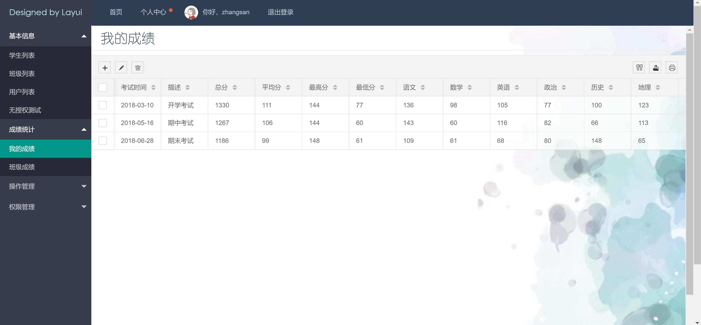

<h1 align="center">学生信息管理系统4</h1>

## 简介
学生信息管理系统4：角色分为管理员、用户；功能涵盖基本信息管理、学生信息维护、考试成绩统计、权限管理与用户操作，提供便捷的用户注册和高效的数据管理界面。    --计算机毕业设计源码；毕设源码；java毕业设计源码

## 联系方式

<h3 align="center">获取完整代码与数据库文件 + 微信：bysj5151 QQ: 86050149 QQ群: 783742310</h3>

<h3 align="center">可帮忙远程部署 包运行成功！提供远程部署、修改代码、设计文档指导、代码讲解等服务！</h3>

## 功能介绍（完整见运行截图）
管理员：基本功能包括用户信息的查看、编辑和删除，注册和登录功能。提供学生信息管理系统的整体数据增删改查，支持成绩统计、用户和班级列表管理、权限管理等。页面设计简洁明了，突出高效管理的特点，确保系统的易用性和操作便利。

用户：可以在学生信息管理系统上进行账号注册和登录，通过查看和更新个人资料来管理自己的信息。可访问学生个人成绩和考试统计，支持成绩搜索、导出和打印功能。界面的设计直观易懂，提供个人中心和退出登录选项，为用户提供了简洁便捷的操作体验。

## 运行截图

本代码来源于网络,仅供学习参考使用!

